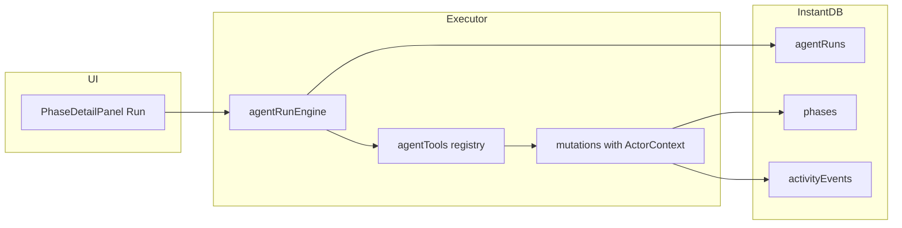

# Agent readiness and first AI integration

## Current state (what you can reuse)

| Area     | Status                                                                                                                                                                                                                                   |
| -------- | ---------------------------------------------------------------------------------------------------------------------------------------------------------------------------------------------------------------------------------------- |
| Data     | [`agents`](src/instant.schema.ts) entity; `assigneeAgentIds` on phases; [`ActivityEvent.actorIsAgent`](src/types/domain.ts)                                                                                                              |
| UI shell | [`AgentChatPanel`](src/layouts/AgentChatPanel.tsx) stub; [`ShellAgentControls`](src/layouts/ShellAgentControls.tsx); assignee pills in Gantt/table/phase detail                                                                          |
| Writes   | Centralized in [`src/lib/instant/mutations.ts`](src/lib/instant/mutations.ts) via `plansStore` + optimistic overlay                                                                                                                      |
| Gaps     | Every mutation hardcodes `actorId: CURRENT_USER_ID` and `actorIsAgent: false`; no `agentRuns`; no agent assign UI in [`PhaseQuickActionDialogs`](src/features/plans/PhaseQuickActionDialogs.tsx); checklist toggles emit **no** activity |

Your choices: **phase-scoped Run** first, **tools before LLM**.



---

## Milestone 0 — App readiness (no LLM)

### 1. Actor context on mutations

Refactor [`mutations.ts`](src/lib/instant/mutations.ts) so writes accept an optional actor:

```ts
type ActorContext = { actorId: string; actorIsAgent: boolean }
// default: CURRENT_USER_ID + false (unchanged human behavior)
```

Thread through: `setPhaseStatus`, `updatePhaseDates`, `toggleChecklistTask`, `updatePhaseDetails`, `addPlanNote`, `appendActivity`, etc.

Add missing audit events where agents need visibility:

- `toggleChecklistTask` → `verb: 'updated'`, payload `{ taskId, completed }`
- `updatePhaseDetails` when `assigneeAgentIds` / `assigneeUserIds` change → `verb: 'assigned'`
- New `postPhaseComment(phase, body, actor)` (mirror `addPlanNote` but `objectType: 'phase'`)

Normalize activity comment payload to `{ body: string }` (fixtures currently mix `text` / `body` in [`fixtures.ts`](src/mock/fixtures.ts) vs [`addPlanNote`](src/lib/instant/mutations.ts)).

### 2. Agent tool registry (deterministic v1)

New module tree (suggested):

- [`src/agents/types.ts`](src/agents/types.ts) — `AgentTool`, `ToolResult`, `ToolContext` (workspace snapshot + `phaseId` + `agentId` + `runId`)
- [`src/agents/tools/index.ts`](src/agents/tools/index.ts) — registry map
- [`src/agents/tools/read.ts`](src/agents/tools/read.ts) — `getPhaseContext`, `listOpenChecklistItems` (pure reads, no Instant writes)
- [`src/agents/tools/write.ts`](src/agents/tools/write.ts) — thin wrappers calling mutations with `actorIsAgent: true`

**V1 tool set (keep to ~6):**

| Tool                                        | Risk   | Maps to                               |
| ------------------------------------------- | ------ | ------------------------------------- |
| `getPhaseContext`                           | read   | phase + plan + checklist + assignees  |
| `postPhaseComment`                          | low    | new comment activity on phase         |
| `setPhaseStatus`                            | medium | existing `setPhaseStatus`             |
| `toggleChecklistTask`                       | low    | existing `toggleChecklistTask`        |
| `updatePhaseDescription`                    | medium | `updatePhaseDetails({ description })` |
| _(defer)_ `updatePhaseDates`, `deletePhase` | high   | approval gate later                   |

Each tool: Zod or hand-rolled input validation, idempotent where possible, returns structured `{ ok, summary, data? }` for UI + future LLM transcripts.

### 3. Agent run model (Instant schema)

Add entity in [`instant.schema.ts`](src/instant.schema.ts):

```ts
agentRuns: i.entity({
  agentId: i.string(),
  phaseId: i.string(),
  planId: i.string(),
  status: i.string(), // queued | running | completed | failed | cancelled
  briefJson: i.string(), // user instruction optional
  resultSummaryJson: i.string().optional(),
  toolTraceJson: i.string().optional(), // [{ tool, input, output, at }]
  requestedByUserId: i.string(),
  startedAt: i.string().optional(),
  completedAt: i.string().optional(),
})
```

Link: `workspaceAgentRuns` (workspace has many runs) or store `planId` only and query by phase.

Extend [`domain.ts`](src/types/domain.ts), [`assembleWorkspace.ts`](src/lib/instant/assembleWorkspace.ts), [`workspaceQuery`](src/lib/instant/assembleWorkspace.ts), [`seed.ts`](src/lib/instant/seed.ts), [`instant.perms.ts`](src/instant.perms.ts) (dev-open like other entities).

Add verbs if needed: `agent_run_started` / `agent_run_completed` as `commented` or `updated` on phase with payload `{ runId, status }` — or rely on `agentRuns` row + phase activity from tools.

### 4. Run engine (deterministic executor)

[`src/agents/runEngine.ts`](src/agents/runEngine.ts):

1. Create run (`queued` → `running`)
2. Load phase context via read tools
3. Execute **fixed playbook** (no LLM yet), e.g. for assigned agent on phase:
   - If status is `todo` and phase has agent assignee → `setPhaseStatus(in_progress)`
   - `postPhaseComment` with templated summary from context (open checklist count, dates, plan name)
   - If exactly one open checklist item → `toggleChecklistTask` _(optional; gate behind env flag if too aggressive)_
4. Mark run `completed` + write `resultSummaryJson` + `toolTraceJson`

Expose via [`plansStore`](src/state/plansStore.ts): `startAgentRunOnPhase(phaseId, agentId, brief?)`.

Runs entirely client-side against Instant (matches current architecture); design `RunEngine` interface so a future server worker swaps in without UI changes.

### 5. UI changes for phase-scoped Run

**Phase detail** ([`PhaseDetailPanel.tsx`](src/features/plans/PhaseDetailPanel.tsx)):

- When `leadAgent` (or any `assigneeAgentIds`) is set, show **Run** button (primary or `pageChrome` variant) + run status chip (`queued` / `running` / `completed`)
- Optional one-line brief input before run (collapsed by default)
- Disable Run while a run is `running`; show last `resultSummary` under activity

**Assign agents** ([`PhaseQuickActionDialogs.tsx`](src/features/plans/PhaseQuickActionDialogs.tsx)):

- Second list: workspace agents with checkboxes (mirror users)
- `updatePhaseDetails({ assigneeAgentIds })` — remove “Agents stay separate” dead-end copy

**Activity / overview** ([`overviewPageLayout.tsx`](src/features/plans/overviewPageLayout.tsx), [`ActivityItem.tsx`](src/components/dance/ActivityItem.tsx)):

- Ensure `commented` on phase renders `payload.body`
- Optional filter/badge for agent-run events

**Agent chat panel** — defer substantive work; optionally show “Runs for this plan” read-only list fed from `agentRuns` query (no send box until milestone 1).

### 6. Dev / config

- [`.env.example`](.env.example): document future `VITE_AGENT_RUNS_ENABLED=true` (feature flag for playbook side effects)
- No OpenAI dependency in milestone 0

---

## Milestone 1 — First real AI integration (after tools work)

Replace deterministic playbook in `runEngine` with an **orchestrator** that:

1. Builds prompt from `getPhaseContext` + user `brief`
2. Calls LLM with **tool definitions** derived from registry (name, description, JSON schema)
3. Loops: model tool call → execute via registry → feed result back (max N steps, e.g. 5)
4. Final natural-language summary → `postPhaseComment` + `resultSummaryJson`

**API hosting (required before prod):**

- Do **not** put provider keys in Vite client bundles
- Add minimal backend: Vite dev proxy to `server/agent.ts` or Instant-adjacent edge function; env `OPENAI_API_KEY` server-only
- Client sends `{ runId, phaseId, agentId, brief }`; server streams or returns tool calls; client still executes tools against Instant **or** server holds service role later

**Scope for first LLM milestone:**

- Same entry: **Run** on phase with assigned agent
- Same 4–5 write tools; no delete/reschedule without human approval
- Model picks tools; playbook remains as fallback when API unavailable

---

## What not to do in v1

- Open-ended “agent uses the whole app”
- Chat-first without run records
- Client-side API keys
- Autonomous delete plan / bulk date shifts
- Inbox/email integrations (separate product surface)

---

## Suggested implementation order

1. `ActorContext` + activity gaps on mutations
2. Tool registry + read/write tools (unit-test playbook inputs/outputs)
3. `agentRuns` schema + query + seed
4. Deterministic `runEngine` + `plansStore.startAgentRunOnPhase`
5. Phase UI: assign agents + Run + run status
6. (Later) LLM orchestrator + server proxy + enable chat send tied to active phase context

---

## Success criteria

**Milestone 0 (demo-ready without AI):**

- User assigns Collie to a phase → clicks **Run** → run row appears → phase activity shows agent comment → status may move to `in_progress` → run marked `completed` with tool trace inspectable in devtools or minimal UI

**Milestone 1:**

- Same flow; summary and tool choices vary with phase context and brief; still bounded to registry tools

---

## Key files to touch

| File                                                                                               | Change                                                       |
| -------------------------------------------------------------------------------------------------- | ------------------------------------------------------------ |
| [`src/instant.schema.ts`](src/instant.schema.ts)                                                   | `agentRuns` entity + link                                    |
| [`src/types/domain.ts`](src/types/domain.ts)                                                       | `AgentRun`, types                                            |
| [`src/lib/instant/mutations.ts`](src/lib/instant/mutations.ts)                                     | `ActorContext`, phase comments, activity on checklist/assign |
| [`src/agents/*`](src/agents/)                                                                      | tools + run engine (new)                                     |
| [`src/state/plansStore.ts`](src/state/plansStore.ts)                                               | `startAgentRunOnPhase`                                       |
| [`src/features/plans/PhaseDetailPanel.tsx`](src/features/plans/PhaseDetailPanel.tsx)               | Run UX                                                       |
| [`src/features/plans/PhaseQuickActionDialogs.tsx`](src/features/plans/PhaseQuickActionDialogs.tsx) | Agent assignees                                              |
| [`src/lib/instant/assembleWorkspace.ts`](src/lib/instant/assembleWorkspace.ts)                     | hydrate runs                                                 |
