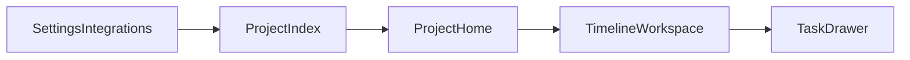
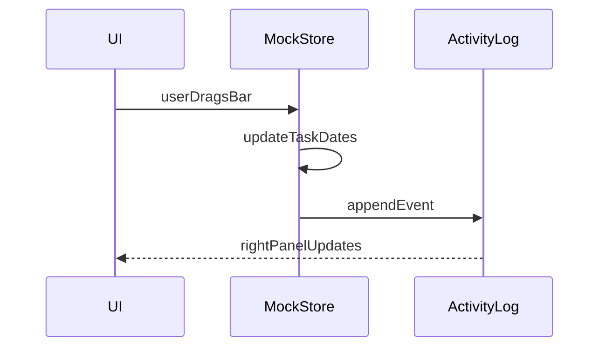

# Dance UI/UX V1 prototype (no backend)

## Goal

Ship a **clickable, locally runnable** prototype that answers: “Can a team navigate this product, understand timelines vs tasks, skim history, and imagine agents as assignees?” **No accounts, billing, Slack, or persistent server.** All state is **in-memory** with optional **localStorage** so refreshes do not wipe the demo.

**UX north star — Linear:** the prototype should **look and feel like [Linear](https://linear.app)** in the ways that matter for a serious work tool—**tight information density**, **border-led surfaces** (not big drop shadows), **keyboard-first navigation** (`Cmd+K` and predictable shortcuts where we show them), **fast/crisp motion**, **sidebar + main + optional right rail**, **sheet-style** task detail, and **list/table ergonomics** (row hover, clear selection, readable meta). **Brand:** keep **Dance's color system** (e.g. mint accent from the reference palette)—do **not** revert to Linear's purple styling; Linear is the **interaction and visual discipline** reference, not a theme to copy hex-for-hex.

## Out of scope (explicit)

- Auth, orgs, roles enforcement, RLS
- Payments
- Slack / webhooks / OAuth
- Real APIs, databases, multi-user sync
- Correct scheduling (critical path, resource leveling, time zones beyond a single display zone)

## Recommended stack (greenfield repo)

| Layer         | Choice                                                            | Rationale                                                                                                                                                                                            |
| ------------- | ----------------------------------------------------------------- | ---------------------------------------------------------------------------------------------------------------------------------------------------------------------------------------------------- |
| App           | **Vite + React + TypeScript**                                     | Fast dev loop, no server assumptions; easy to add Next later if you standardize on it.                                                                                                               |
| Routing       | **React Router**                                                  | Mirrors real app navigation (project, timeline, task deep links).                                                                                                                                    |
| Styling       | **Tailwind CSS**                                                  | Speed for layout density (sidebars, tables, Gantt rows).                                                                                                                                             |
| Design tokens | **CSS variables** mapped into `tailwind.config`                   | Single source for color, radius, fonts; semantic tokens for statuses and timeline health.                                                                                                            |
| Components    | **shadcn/ui** (Radix + CVA) — **baseline for v1**                 | Copy-in components you own; accessibility and keyboard UX for palette, dialogs, sheets, menus.                                                                                                       |
| Icons         | **lucide-react**                                                  | Neutral, product-y.                                                                                                                                                                                  |
| Dates         | **date-fns**                                                      | Lightweight formatting and day math for the chart.                                                                                                                                                   |
| Gantt         | **Start custom (CSS grid / flex rows)** or a **thin OSS wrapper** | For v1, prefer a **small custom renderer** (rows = tasks, bars = date ranges) so you are not fighting library APIs before the model is stable. Add a library only if drag-resize becomes too costly. |

If you strongly prefer **Next.js** for future SSR, the same component plan applies—just swap the bootstrap step; keep data client-side.

## Design system and components

Treat this as three layers so the prototype feels like a product, not wireframes.

### Linear-like look and feel (how to implement)

Use this checklist when building chrome and screens so the app reads as **Linear-class** polish while staying **Dance-branded**:

- **Density:** prefer compact rows and padding that still hit **44px minimum touch** where primary nav applies; tables, Gantt rows, and activity can go **tighter** than consumer apps—optimize for scanning.
- **Chrome:** **1px `border` / `separator` hierarchy** on `background` and `card`; **avoid heavy shadows** on the shell. Overlays (sheet, popover, menu) can be slightly elevated but stay subtle.
- **Keyboard:** **`Cmd+K`** command surface is non-negotiable for v1; expose shortcuts in UI where Linear would (e.g. search field hint). Tab focus rings must be visible (`--ring`); reduce motion when `prefers-reduced-motion`.
- **Navigation:** **persistent left rail** with clear active state; inline **pill/badge** counts where useful; section labels **small + muted** (Linear-style hierarchy).
- **Lists & tables:** **hover wash** on rows; **selected** row or bar state distinct from hover; status and assignee read as **small inline elements**, not chunky cards.
- **Task / issue detail:** **slide-over sheet** from the right (or consistent edge) rather than a centered modal for the main task UX; content structure mirrors “issue detail” scannability (title → meta → body → sub-entities).
- **Motion:** **short durations** (roughly **150–200ms** for UI chrome), **ease-out**; sheets/dialogs animate **opacity + slight translate**—no bouncy or playful easing in the shell.
- **Typography:** **single clean sans** (Inter / Geist-class); **muted secondary line** for metadata; avoid decorative display fonts in app UI.
- **What not to do:** marketing-style hero sections inside the app shell, oversized rounded “cards” for every row, or neon glow effects that fight Linear-like restraint.

When mockup spacing (e.g. sidebar pixel spec) conflicts with Linear density, **prioritize Linear feel**—keep rhythm consistent and adjust numbers slightly if the UI feels too airy or too cramped in practice.

### Tokens and global styles

- `**src/styles/globals.css` (or equivalent):** define **semantic CSS variables** (shadcn-style): background/foreground/card/border/input/ring/primary/accent/destructive/muted, plus **Dance semantics** mapped to Tailwind utilities (examples: `--status-todo`, `--status-in-progress`, `--status-blocked`, `--status-done`, `--timeline-healthy`, `--timeline-at-risk`, `**--accent-agent`\*\* distinct from primary so agent affordances stay recognizable).
- **Typography:** pick one sans stack (e.g. **Geist Sans** or **Inter**) via `@font-face` or hosting-friendly import; define a small **type ramp** (page title, section, body, table/meta, monospace for IDs if needed) using Tailwind `@apply` or utility classes documented in one place.
- **Radius and elevation:** align `radius` with shadcn defaults; use **subtle borders** over heavy shadows for Linear-like density.
- **Motion:** standard transition tokens for sheet/dialog open; **respect `prefers-reduced-motion`** for drag and panel animations.
- **Theme default:** structure tokens so `:root` (or `.dark`) can adopt the palette below; v1 can ship **dark-first** to match the reference UI, with an optional light theme later.

### Color palette (dark UI reference)

Extracted from the filter UI reference. These are **Dance's** dark surfaces and accent—they support the **Linear-like** shell (density, borders, keyboard UX) without imitating Linear's purple brand. Use these hex values in `**globals.css`** (CSS variables) and mirror them in `**tailwind.config\*\*` so primitives and Dance wrappers pull from tokens—not raw hex in components.

**Core palette**

| Role                            | Hex       | Usage                                                                                 |
| ------------------------------- | --------- | ------------------------------------------------------------------------------------- |
| App / canvas background         | `#0D0D0D` | Page shell; optional subtle dot-grid texture at low opacity                           |
| Panel / card / elevated surface | `#1A1A1A` | Filter modules, side panels, inputs-on-canvas                                         |
| Border / divider                | `#2A2A2A` | Panel outlines, separators, input borders                                             |
| Foreground (primary text)       | `#E0E0E0` | Titles, active labels, primary copy                                                   |
| Muted foreground                | `#757575` | Placeholders, inactive options, counts, secondary labels                              |
| Primary / accent (interactive)  | `#00E699` | Selected radios/checkboxes, active tags, histogram emphasis, focus-ring partner color |
| Avatar / chip accent (blue)     | `#5C6BC0` | Assignee letter tiles, categorical accent 1                                           |
| Avatar / chip accent (coral)    | `#FF6B6B` | Assignee letter tiles, categorical accent 2, warm contrast                            |

**Suggested semantic map (shadcn-style HSL variables)**

Map the above into your theme; example pairings for a **dark-first** `:root`:

| Semantic token           | Suggested source                    | Notes                                            |
| ------------------------ | ----------------------------------- | ------------------------------------------------ |
| `--background`           | `#0D0D0D`                           | shadcn `background`                              |
| `--foreground`           | `#E0E0E0`                           | shadcn `foreground`                              |
| `--card`                 | `#1A1A1A`                           | Popovers, cards, nested panels                   |
| `--card-foreground`      | `#E0E0E0`                           |                                                  |
| `--popover`              | `#1A1A1A`                           | Match card or one step lighter if needed         |
| `--popover-foreground`   | `#E0E0E0`                           |                                                  |
| `--border`               | `#2A2A2A`                           |                                                  |
| `--input`                | `#2A2A2A`                           |                                                  |
| `--ring`                 | `#00E699`                           | Focus rings; pair with lower opacity if too loud |
| `--primary`              | `#00E699`                           | Primary buttons, committed selection             |
| `--primary-foreground`   | `#0D0D0D`                           | Text on primary-filled controls                  |
| `--secondary`            | `#1A1A1A`                           | Secondary surfaces                               |
| `--secondary-foreground` | `#E0E0E0`                           |                                                  |
| `--muted`                | `#1A1A1A` or a hair above `#0D0D0D` | Muted blocks / hover wash                        |
| `--muted-foreground`     | `#757575`                           |                                                  |
| `--accent`               | `rgba(0, 230, 153, 0.12)` (example) | Selected row wash derived from mint              |
| `--accent-foreground`    | `#00E699` or `#E0E0E0`              | Tune for contrast on wash                        |

**Dance / product semantics** (keep distinct from generic `primary` where clarity helps):

- `**--accent-agent`:\*\* use mint `#00E699` or a slightly adjusted green so AI assignees stay on-brand.
- **Status / timeline health:** map `--status-*` and `--timeline-*` to mint for “healthy / on track,” coral `#FF6B6B` for risk/blocked (aligns with reference accent pairings), blue `#5C6BC0` for neutral/in-progress if needed.

**Chrome notes**

- **Radius:** reference UI reads ~4–6px on panels and inputs; align `--radius` to **6px** (0.375rem) unless you standardize on shadcn default.
- **Data viz (e.g. histograms):** use `**#00E699`\*\* for active series; muted bars can use `#2A2A2A` or low-opacity foreground.

### shadcn/ui baseline (primitives)

- Run **shadcn init** for Vite + React + TS + Tailwind; set aliases (`@/components`, `@/lib/utils`).
- Pull in primitives needed for the v1 IA (add others only when a screen needs them):
  - Shell and forms: **Button**, **Input**, **Textarea**, **Label**, **Checkbox** (optional for subtasks)
  - Surfacing structure: **Card**, **Separator**, **ScrollArea**, **Skeleton**
  - Navigation and mode switching: **Tabs**, **DropdownMenu**, **NavigationMenu** (optional)
  - Overlays and command UI: **Dialog**, **Sheet**, **Popover**, **Tooltip**, **Command** (cmdk) for `**Cmd+K`\*\*
  - Density signals: **Badge**, **Avatar**

This gives you consistent focus rings, radix behavior, and a path to iterate without swapping libraries later.

### Dance wrappers (design system layer)

Thin **app-local components** built on primitives—keeps screens consistent and encodes Dance UX rules:

| Wrapper                                          | Role                                                                                                    |
| ------------------------------------------------ | ------------------------------------------------------------------------------------------------------- |
| `StatusBadge` / `TimelineStatusBadge`            | Map domain enums → token-backed colors                                                                  |
| `AssigneePill`                                   | Human vs **agent** treatment (badge variant, optional spark icon, tooltip “AI coworker”)                |
| `PageHeader`, `SidebarNav`, `TimelineViewToggle` | Shared chrome for top bar and Gantt/Table/Board control                                                 |
| `IntegrationTile`                                | Settings grid tile (logo slot, status, CTA placeholder)                                                 |
| `ActivityItem`                                   | One row in the history stream (actor, verb, object, relative time)                                      |
| `GanttRow` / `GanttBar`                          | Row layout and bar fill using status tokens (implementation stays domain-aware but colors come from DS) |

**Rule:** primitives live under `components/ui/`; Dance composites live under `components/dance/` (or `components/collie/` if you keep that folder name) so you never fork Button styles per screen.

### Side panel spacing (reference mockup)

Use these measurements when implementing `**SidebarNav`\*\* / the left shell so density and rhythm match the annotated reference (adapt colors and radius to Dance tokens).

| Token                   | Value                                                            | Notes                                                                                 |
| ----------------------- | ---------------------------------------------------------------- | ------------------------------------------------------------------------------------- |
| Panel width             | **260px**                                                        | Fixed width for the sidebar column                                                    |
| Major vertical gap      | **16px**                                                         | Between header, search, section blocks (“Menu”, “Account”)                            |
| Minor vertical gap      | **4px**                                                          | Between nav rows                                                                      |
| Edge horizontal padding | **16px**                                                         | Panel left/right; section titles inset **16px** from left                             |
| Logo                    | **40×40**                                                        | Brand mark in header                                                                  |
| Header padding          | **16px** top, **16px** left                                      | Logo + title row                                                                      |
| Logo ↔ title            | **12px**                                                         | Horizontal gap                                                                        |
| Space below header      | **16px**                                                         | Before search block                                                                   |
| Search margins          | **16px** top & bottom                                            | Around the search field                                                               |
| Search field            | `**--card` or input surface\*\*, rounded                         | Magnifier left, “Search” placeholder, **⌘K** hint right (kbd-style); border `--input` |
| Nav row height          | **44px**                                                         | Each item                                                                             |
| Row horizontal padding  | **12px** left of icon, **16px** right                            |                                                                                       |
| Icon column             | **20px** wide                                                    | Icons centered in column                                                              |
| Icon ↔ label            | **12px**                                                         |                                                                                       |
| Section title           | Muted / light gray                                               | “Menu”, “Account” (or Dance `muted-foreground` equivalent)                            |
| Active row              | Muted wash + rounded (`--accent` wash or `#1A1A1A` on `#0D0D0D`) | e.g. current route; optional mint left border or dot using `--primary`                |
| Notification badges     | Right-aligned on row                                             | Pill/badge overlay (reference mock: blue count on “My Task”, purple on “Messages”)    |

**Global panel chrome:** use **dark palette** surfaces (`--card` `#1A1A1A` on `--background` `#0D0D0D`, borders `#2A2A2A`) from **[Color palette (dark UI reference)](#color-palette-dark-ui-reference)**—the original mock showed a light sidebar; for Dance, keep **these spacing numbers** and **swap fills** to the dark tokens. Treat the sidebar as **Linear-like**: quiet background, **border separation** from main if needed, **muted section labels**, **obvious active row**—not a marketing panel.

### How this ties to Definition of Done

- No one-off hex colors on feature screens unless tokenized afterward.
- New UI patterns extend **wrappers or tokens**, not raw Tailwind sprinkled everywhere.
- Shell and primary surfaces meet **[Linear-like look and feel](#linear-like-look-and-feel-how-to-implement)** (density, borders, keyboard, sheets)—with **Dance** colors from the palette section, not a third ad-hoc theme.

## Information architecture and routes

Mock a **single workspace** (hardcoded name) to avoid empty states everywhere.

Suggested routes:

- `/` — **Project index** (cards or table): name, date range rollup, timeline count, health/status chip
- `/projects/:projectId` — **Project home**: summary + list of timelines (status, owner, date span, task counts)
- `/projects/:projectId/timelines/:timelineId` — **Primary work surface** (see below)
- `/settings` — **Integrations gallery** (static tiles: Slack, Gmail, Notion…) with “Not connected” and copy that explains intent—no OAuth

Deep-linking goal: `**/projects/p1/timelines/t3?task=x7`\*\* opens the task drawer for `x7`.

## Primary work surface (`TimelineWorkspace`)

This is where “Linear + Gantt” must converge.

**Layout (desktop-first):**

1. **Left sidebar** — **260px** wide; spacing per **[Side panel spacing (reference mockup)](#side-panel-spacing-reference-mockup)**. Contents: project switcher (mock list), shortcuts to timelines within current project.
2. **Main top bar** — timeline title + status badge + date range summary; segmented control: `**Gantt` | `Table` | `Board` (stub)\*\*.
3. **Center** — main view per mode:

- **Gantt (v1 hero):** swimlane per **section/group** or flat list; each row shows task title, assignee pills, bar with start/end. Interactions:
  - **Drag bar horizontally** → updates `start`/`end` in local state only
  - **Resize ends** optional if timeboxed; horizontal move alone is acceptable for v1
- **Table:** dense list (Linear-like): status, priority (optional), assignee, dates, grouped by section.
- **Board:** Kanban columns by status — can be minimal columns with a few tasks to prove parity.

4. **Right panel (collapsible)** — **Activity / history** scoped to selection: whole timeline vs selected task; list of chronological events (“Alex moved Roo’s kickoff checklist from Todo → Doing”).
5. **Command palette placeholder** (`Cmd+K`) — fuzzy jump to tasks/timelines; static index over mock data. This sells “Linear-like” discipline even before real search.

## Task drawer / modal

Clicking a task opens a **slide-over**:

- Title, description (rich text optional; plain textarea is fine)
- Status, dates (mirror Gantt edits)
- **Assignees:** mix of humans + **agents** (distinct visual treatment—label, tooltip “AI coworker”)
- Subtasks checklist (mock)
- **Mini activity** for just this task (subset of global stream)

Agents do not execute anything; they appear in UI and fake event copy.

## Project-level aggregation

Project home surfaces:

- Timeline cards with owner and **rollup** (“12 open / 3 blocked” mock fields)
- A **pseudo health** indicator (derived from mocked fields, not computed scheduling)

## Mock data architecture

Centralize fixtures so UI stays honest:

- `src/types/domain.ts` — `Workspace`, `Project`, `Timeline`, `Task`, `User`, `Agent`, `ActivityEvent`, enums for `TaskStatus`, `TimelineStatus`
- `src/mock/fixtures.ts` — rich seed (2 projects, 3–4 timelines, 40–80 tasks, 2 agents, 10+ humans)
- `src/state/store.ts` — **lightweight reducer or Zustand** for mutations (drag tasks, toggle status); emit **derived activity rows** onto an in-memory timeline so the right panel feels alive

Optional: `**localStorage` persistence\*\* behind a dev toggle so stakeholder demos survive refresh.

Activity events should be **structured** even in mock (`actor`, `verb`, `object`, `timestamp`, optional `payload`) so the UI you build aligns with a future audit log.

## Key UX hypotheses to validate in v1

- **Timeline as first-class navigation** vs task-first search
- Density tradeoff between **Gantt** and **Table** for field marketing workloads
- Whether **agents** read as coworkers (assignment, attribution in activity) or as gimmicks—tune avatar, labeling, and event phrasing accordingly
- **Settings → integrations** as narrative only: do tiles communicate value without OAuth?

## Definition of done (v1)

- Repo runs via `pnpm dev` / `npm run dev` with a short README describing scope and shortcuts
- **Design system:** shadcn installed; tokens and semantic colors in place; primitives + **Dance** wrappers used for chrome, badges, drawers, and command palette—not ad-hoc buttons/inputs per route
- **Linear-like UX:** stakeholder pass should read the app as **in the same class as Linear** for shell behavior—dense lists, border-led layout, obvious **Cmd+K**, sheet task detail, crisp transitions—while colors remain **Dance** (palette section)
- All routes navigable without console errors
- Gantt demonstrates **meaningful density** (enough tasks to scroll) plus **drag-to-reschedule** (move only acceptable)
- Activity stream updates after local mutations
- At least **two timelines** demo **overlapping date ranges** to force clarity in project home
- **Cmd+K** navigates to a known task/project
- **Settings** presents integration placeholders consistent with eventual product framing

## Follow-on (after you approve feel)

Pick backend shape (REST vs tRPC, Postgres schema) using the same TS types as source of partial truth; swap mock store for API client without redesigning shells.
