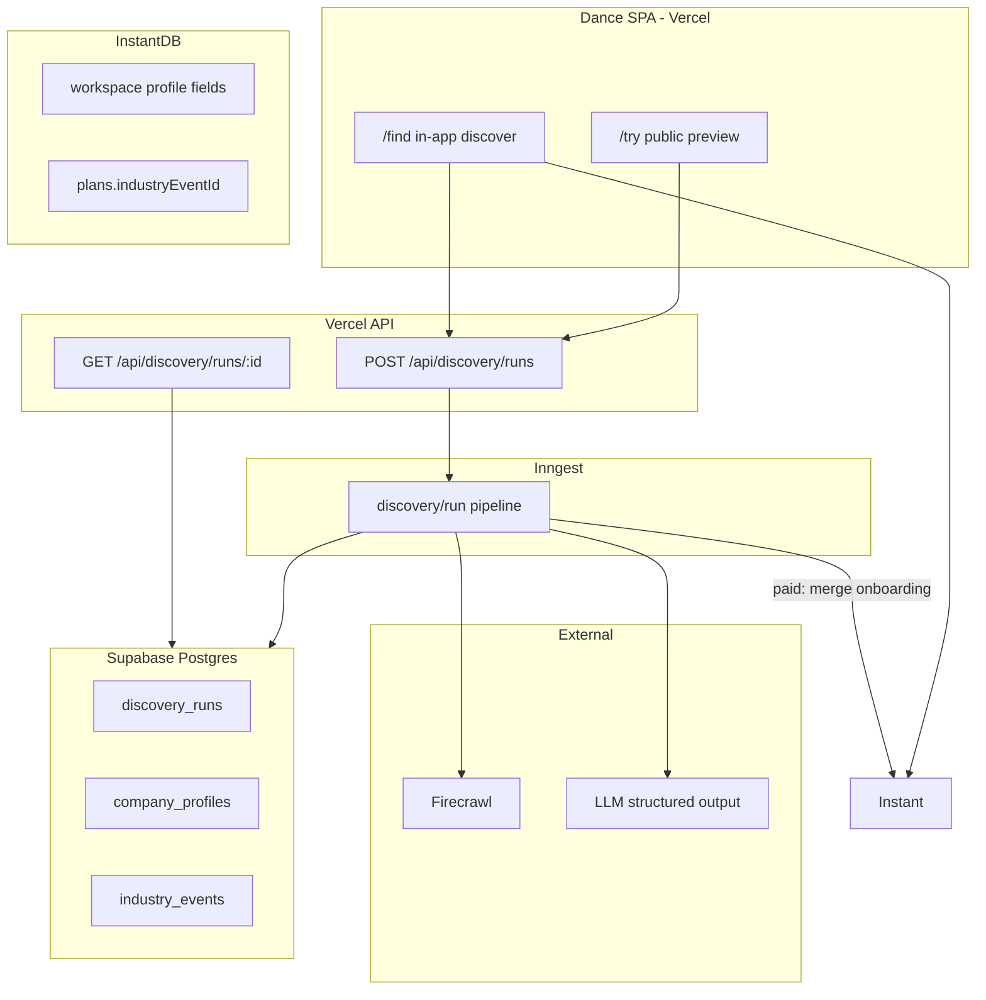
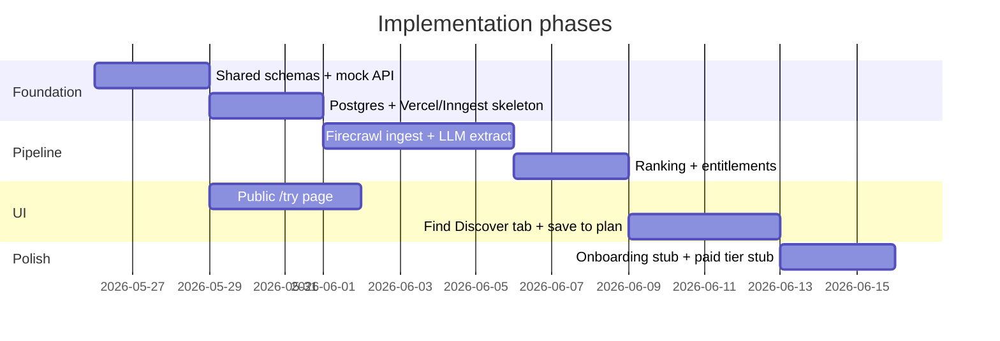

# Event Discovery with Firecrawl

## Locked decisions

- **Hosting:** Vercel (static SPA + serverless API routes) + **Inngest** for async pipeline jobs
- **Public tool:** Same repo, route **`/try`** with minimal chrome (outside [`AppShell`](src/layouts/AppShell.tsx))
- **Secrets:** Firecrawl + LLM keys server-only; never in Vite `import.meta.env` except public API base URL
- **Gating:** Server omits rows beyond preview cap; blur in UI is cosmetic only

## Current codebase anchors

| Concern            | Today                                                                                                                                        | Reuse                                              |
| ------------------ | -------------------------------------------------------------------------------------------------------------------------------------------- | -------------------------------------------------- |
| Event result shape | [`FindIndustryEvent`](src/mock/findIndustryCatalog.ts)                                                                                       | Extend with optional provenance fields server-side |
| Find UI            | [`FindIndustryEventsPage`](src/pages/FindIndustryEventsPage.tsx), [`FindIndustryEventDetailPage`](src/pages/FindIndustryEventDetailPage.tsx) | Add Discover tab + wire to API                     |
| Plan linkage       | `plans.industryEventId` in [`instant.schema.ts`](src/instant.schema.ts) + [`Plan`](src/types/domain.ts)                                      | "Add to workspace" creates plan with catalog id    |
| Backend            | None ([`README.md`](README.md))                                                                                                              | Greenfield `api/` + Inngest                        |

---

## Target architecture



### Request flow

1. Client submits URL (+ optional `workspaceId` for in-app)
2. API validates URL, resolves **tier**, checks rate limits, inserts `discovery_runs` row, enqueues Inngest event
3. Worker runs pipeline stages with progress updates on the run row
4. Client polls `GET /api/discovery/runs/:id` until `status: complete`
5. API returns **tier-sliced** payload (anonymous: top 3 + `totalCount`; paid: full list + filters allowed)

---

## Repo layout (monorepo additions)

```
dance/
  src/                          # existing SPA (unchanged patterns)
  api/
    discovery/
      runs.ts                   # POST + GET handlers (Vercel)
    _lib/
      entitlements.ts
      rateLimit.ts
  packages/
    discovery/                  # pure pipeline (unit-testable)
      pipeline.ts
      firecrawl.ts
      extract.ts
      rank.ts
    shared/
      schemas.ts                # Zod: CompanyProfile, DiscoveredEvent, API DTOs
  inngest/
    client.ts
    functions/discoveryRun.ts
  supabase/migrations/          # or drizzle schema
```

Add npm workspaces in root [`package.json`](package.json) (`packages/*`). Vite imports types from `packages/shared` via path alias.

---

## Data model

### Postgres (discovery catalog — source of truth for scraped events)

**`discovery_runs`**

- `id`, `status` (`queued` | `reading_site` | `finding_events` | `ranking` | `complete` | `failed`)
- `input_url`, `normalized_domain`, `tier`, `workspace_id` (nullable), `anonymous_fingerprint`
- `progress_step`, `error_message`, `total_count`, `created_at`, `completed_at`

**`company_profiles`** (1:1 with run, or cached by domain)

- `run_id`, `domain`, `profile_json` (industry, products, ICP, geos, keywords)

**`industry_events`** (deduped catalog rows)

- `id`, `canonical_key` (hash of name+start+organizer), fields matching `FindIndustryEvent`
- `source_url`, `confidence`, `discovered_at`
- Join table **`discovery_run_events`**: `run_id`, `event_id`, `rank`, `fit_score`, `rationale`

Domain-level cache: if `normalized_domain` scraped within 7 days, skip Firecrawl ingest and re-rank with fresh workspace context (paid only).

### InstantDB extensions ([`instant.schema.ts`](src/instant.schema.ts))

Add to **`workspaces`** (onboarding stub for v1):

- `companyWebsiteUrl`, `industry`, `icpDescription`, `targetGeosJson`, `productCategory`

Optional later: `savedIndustryEventIdsJson` on workspace or link entity.

**`plans.industryEventId`** already exists — no schema change needed for save-to-workspace.

---

## Discovery pipeline (Inngest function)

Single function `discovery/run` with step retries and hard budgets:

| Step | Action                                                                                                           | Caps                     |
| ---- | ---------------------------------------------------------------------------------------------------------------- | ------------------------ |
| 1    | Normalize URL; block private IPs / localhost                                                                     | —                        |
| 2    | Firecrawl **map + scrape** company domain (about, product, pricing)                                              | max 8 pages, 60s         |
| 3    | LLM → `CompanyProfile` (Zod schema)                                                                              | token budget             |
| 4    | Merge workspace onboarding fields when `workspaceId` + paid tier                                                 | —                        |
| 5    | Firecrawl **search** for industry events (fixed query templates from profile keywords) + scrape top result pages | max 5 searches, 10 pages |
| 6    | LLM → `DiscoveredEvent[]` (dates required; drop low confidence)                                                  | token budget             |
| 7    | Dedupe → upsert `industry_events` → rank (date proximity + geo/ICP match + LLM `fitScore`)                       | —                        |
| 8    | Mark run `complete`; store `total_count`                                                                         | wall clock 3 min max     |

**`DISCOVERY_MOCK=1`:** skip Firecrawl/LLM; return fixture JSON from [`FIND_INDUSTRY_CATALOG`](src/mock/findIndustryCatalog.ts) for cheap UI iteration.

Firecrawl v1 path: **search + scrape** (not Agent) to keep cost predictable.

---

## API contract

### `POST /api/discovery/runs`

```typescript
// Request
{ url: string; workspaceId?: string }

// Response 202
{ runId: string; status: 'queued' }
```

### `GET /api/discovery/runs/:id`

```typescript
// Response (tier-sliced)
{
  runId: string
  status: DiscoveryStatus
  progressStep?: string
  totalCount?: number        // always safe to expose
  events?: FindIndustryEvent[]  // length capped by tier
  error?: string
}
```

### Entitlements ([`api/_lib/entitlements.ts`](api/_lib/entitlements.ts))

| Tier        | How resolved                                 | Events returned | Filters             | Rate limit             |
| ----------- | -------------------------------------------- | --------------- | ------------------- | ---------------------- |
| `anonymous` | no auth                                      | top **3**       | reject query params | 2 runs / IP / day      |
| `paid`      | dev stub header → later Instant JWT + Stripe | **all ranked**  | enabled             | generous per workspace |

**Critical:** anonymous response never includes event ids beyond rank 3 (prevents client devtools bypass). `totalCount` drives "We found N events" + blurred placeholder cards in UI.

Paid tier: API reads workspace profile from Instant **admin SDK** (server-side) using `workspaceId`; merges into ranking prompt.

---

## Frontend work

### 1. Public preview — `/try`

- New route in [`App.tsx`](src/App.tsx) **outside** `AppShell` (no sidebar; focused landing)
- New [`src/pages/TryDiscoveryPage.tsx`](src/pages/TryDiscoveryPage.tsx):
  - URL input + validation
  - Stepper: "Reading site" → "Finding events" → "Ranking"
  - Poll discovery API every 2s
  - Results: 3 clear cards + 3–6 **blurred placeholder** cards + copy: "Sign up for Dance to see all {totalCount} events"
  - CTA → placeholder signup route (link to `/` or external waitlist until auth lands)
- Shared components: extract from Find grid into [`src/components/dance/IndustryEventCard.tsx`](src/components/dance/IndustryEventCard.tsx)

### 2. In-app discover — `/find`

- Extend [`FindIndustryEventsPage`](src/pages/FindIndustryEventsPage.tsx): new **Discover** tab (alongside Applied/Attending/Past)
  - Prefill URL from `workspace.companyWebsiteUrl` when set
  - Full results for paid tier; same preview UX for anonymous/demo until auth wired
  - Filter controls (date range, geo) — disabled + tooltip when not entitled
- [`src/lib/discoveryClient.ts`](src/lib/discoveryClient.ts): typed fetch wrapper using `VITE_DISCOVERY_API_URL`
- Dev proxy in [`vite.config.ts`](vite.config.ts): `/api` → local Vercel dev

### 3. Save to workspace

- Enable "Add to workspace" on [`FindIndustryEventDetailPage`](src/pages/FindIndustryEventDetailPage.tsx)
- New mutation in [`src/lib/instant/mutations.ts`](src/lib/instant/mutations.ts): `createPlanFromIndustryEvent(eventId, catalogFields)` → sets `industryEventId`, seeds name/dates/location from catalog

### 4. Onboarding stub (minimal, unblocks paid context)

- Extend workspace seed + settings or a simple onboarding modal: collect `companyWebsiteUrl`, industry, ICP, geos
- Persist on `workspaces` entity in Instant schema
- In-app discover passes `workspaceId` to API

---

## Vercel + Inngest setup

- **`vercel.json`:** SPA rewrites for React Router; `/api/*` to serverless functions
- **Inngest:** `inngest/dev` locally; register `discovery/run` function; Vercel serves Inngest webhook at `/api/inngest`
- **Env vars (Vercel):** `FIRECRAWL_API_KEY`, `OPENAI_API_KEY` (or chosen LLM), `DATABASE_URL`, `INNGEST_EVENT_KEY`, `INNGEST_SIGNING_KEY`, `INSTANT_APP_ADMIN_TOKEN`, `DISCOVERY_MOCK`
- **Env vars (Vite):** `VITE_DISCOVERY_API_URL` only

---

## Security and abuse

- URL allowlist: http/https only; resolve DNS; reject RFC1918/link-local
- Per-IP + fingerprint cookie rate limits (Upstash Redis or Vercel KV)
- Structured logging with `runId`; never log full HTML
- CORS: allow SPA origin only on discovery endpoints

---

## Phased delivery



**Phase 1 — Foundation (shippable UI with mocks):** `packages/shared`, mock API, `/try` page, polling client  
**Phase 2 — Infrastructure:** Supabase tables, Vercel API routes, Inngest wiring  
**Phase 3 — Real pipeline:** Firecrawl + LLM with cost caps and `DISCOVERY_MOCK` fallback  
**Phase 4 — Entitlements:** anonymous preview enforcement, paid stub via header/dev flag  
**Phase 5 — App integration:** Find Discover tab, workspace prefill, create plan from event  
**Phase 6 — Onboarding:** workspace profile fields; merge into paid ranking

---

## Acceptance criteria

- Anonymous user completes `/try` end-to-end; API returns **at most 3** events; `totalCount` may be higher
- Filter query params return **403** for anonymous tier
- Paid stub (dev flag or test header) returns full ranked list from same pipeline
- No Firecrawl/LLM keys in client bundle (`grep` CI check)
- "Add to workspace" creates a plan with `industryEventId` populated
- Pipeline failures surface user-friendly errors; runs recover via Inngest retries where safe

---

## Out of scope for v1

- Real Clerk/Stripe auth (design API for it; stub tier only)
- Firecrawl Agent mode
- Continuous re-crawl / email alerts
- Separate marketing site repo
- Moving full catalog into InstantDB (Postgres remains catalog SoT)
