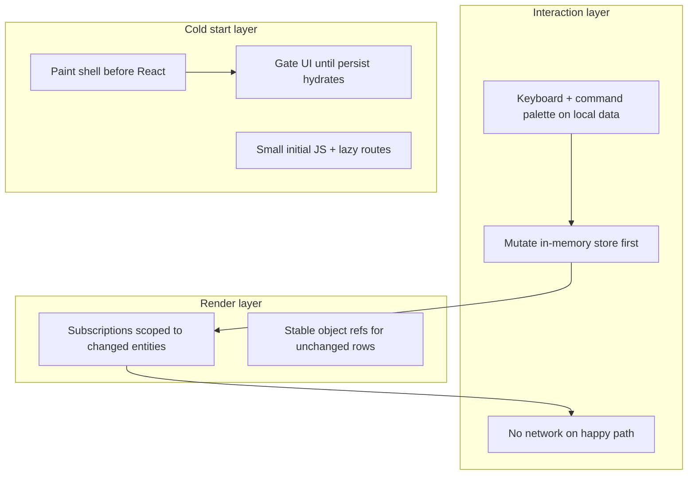
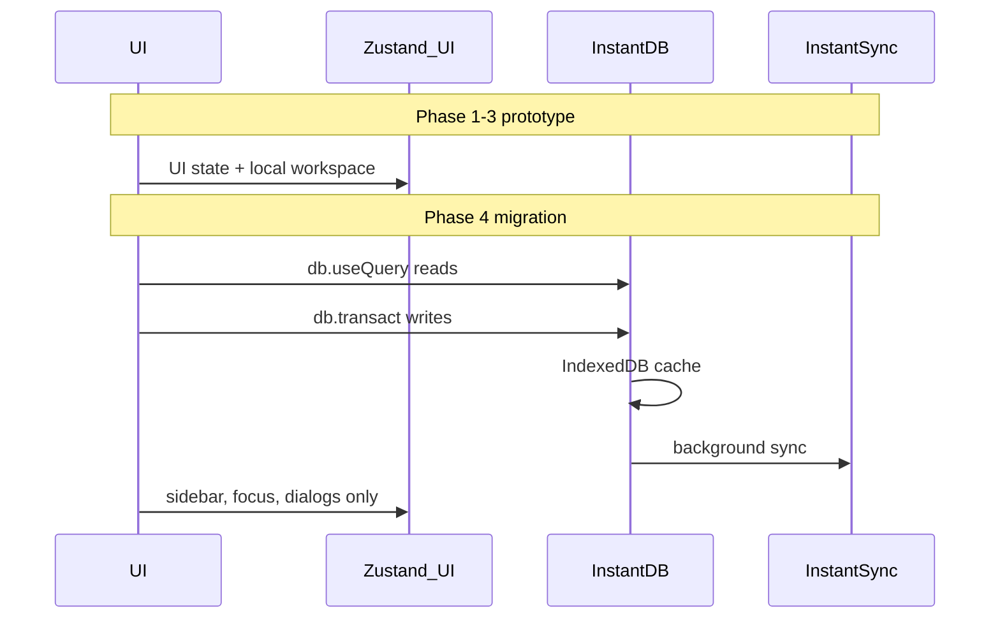

# Linear-feel roadmap for Dance

## North star

Linear’s speed comes from a **system**, not one library:



Dance already has the **right stack and product direction** ([v1 plan](.cursor/plans/dance_ui_ux_v1_prototype_c50fb0a3.plan.md): Linear-like density, keyboard, sheets). Gaps are **depth**: render granularity, command surface, cold-start shell, and doc/trigger alignment—not a pivot away from Vite + React + Zustand + Radix.

**Backend:** **[InstantDB](https://www.instantdb.com/)** is the chosen backend — client-side triple store, IndexedDB cache, optimistic `db.transact()`, realtime, and offline out of the box ([architecture](https://github.com/instantdb/instant)). This matches the [performance.dev Linear breakdown](https://performance.dev/how-is-linear-so-fast-a-technical-breakdown) without building a custom sync engine. **Phases 1–3** run on the current Zustand prototype; **Phase 4** migrates domain data to Instant. **Supabase is out of scope.**

**Hybrid model (final architecture):**

- **InstantDB** — projects, timelines, tasks, users, agents, activity log
- **Zustand** — UI-only: sidebar, command open, hover/focus, view mode, dialogs, local undo/redo UX

---

## Current state snapshot (what the plan builds on)

**Preserve — do not regress:**

- Instant local mutations in [`store.ts`](src/state/store.ts) (no fetch/spinners on edits)
- Gantt drag → `updateTaskDates` + activity events
- Undo stack; keyboard shortcuts (`S`/`P`/`A`/`V`/`⌘Z`); hover hit-testing in Gantt/table
- Motion tokens in [`index.css`](src/index.css); sheet overlay/panel pairing
- Zustand persist key `dance-prototype-v1`; [`sanitizeWorkspace`](src/lib/taskStatus.ts) for drift

**Fix — known bottlenecks:**

- `structuredClone` on every write → all task refs change → per-row Gantt selectors ineffective
- **8 files** subscribe to full `s.workspace` (incl. [`TaskQuickActionDialogs.tsx`](src/components/dance/TaskQuickActionDialogs.tsx))
- Static [`COMMAND_INDEX`](src/mock/fixtures.ts); trigger is `/` not `⌘K` (README/plan say `⌘K`)
- No boot shell / hydrate gate → fixture flash before persist merges
- ~637KB single JS chunk; Google Fonts blocking chain

**Constraints during refactors:**

- Keep `sanitizeWorkspace` working with new update strategy (Immer or surgical copy)
- Define **list focus** vs **`selectedTaskId`** (sheet + `?task=` deep links + `registerTaskSheetAnimatedCloseHandler`)
- [`TimelineTableView.tsx`](src/components/dance/timeline/TimelineTableView.tsx) is props-driven — fix parent re-renders first, not table internals
- UI-only state stays in Zustand permanently; domain data migrates to Instant in Phase 4
- Phase 1.1 (surgical Zustand writes) is a **bridge** until Instant owns domain mutations — do not over-invest in Immer/outbox patterns that Instant replaces

---

## Phase 1 — Interaction truth (highest daily-use impact)

**Goal:** Every edit feels instant; keyboard and palette match Linear muscle memory; timeline doesn’t jank on small changes.

### 1.1 Fix store updates so granular subscriptions work

Today every mutation runs `structuredClone` on the whole workspace ([`store.ts`](src/state/store.ts) `cloneWorkspace`), so per-row selectors like [`GanttView.tsx`](src/components/dance/timeline/GanttView.tsx) still re-render all rows.

- Introduce **surgical updates** (recommended: `immer` middleware on the Zustand store, or shallow-copy only `tasks[id]` / affected `timelines[id]` branches).
- Keep undo frames as full snapshots (acceptable cost); only optimize **hot-path writes**.
- Add small store selectors/helpers, e.g. `selectSidebarNav`, `selectTimelineBundle(timelineId)` returning stable derived data.

### 1.2 Narrow Zustand subscriptions on hot paths

Replace `useDanceStore((s) => s.workspace)` in:

| File                                                                              | Target selector                                                                  |
| --------------------------------------------------------------------------------- | -------------------------------------------------------------------------------- |
| [`AppShell.tsx`](src/layouts/AppShell.tsx)                                        | `workspace.name` + `workspace.projects` via `useShallow`                         |
| [`TimelineWorkspacePage.tsx`](src/pages/TimelineWorkspacePage.tsx)                | Active project, timeline, `taskIds` list + task map slice for that timeline only |
| [`GlobalKeyboardShortcuts.tsx`](src/components/dance/GlobalKeyboardShortcuts.tsx) | `getState()` in handlers only; drop full-workspace subscription                  |
| [`TaskQuickActionDialogs.tsx`](src/components/dance/TaskQuickActionDialogs.tsx)   | Users slice only (assignee dialogs)                                              |
| Other pages                                                                       | Same pattern: smallest slice needed                                              |

Add `useShallow` from `zustand/react/shallow` where multi-field picks are needed.

### 1.3 Memoize heavy lists

- Wrap Gantt row / table row components in `React.memo` with compare on fields that affect paint (id, dates, status, title, selection).
- Keep existing per-row `liveTask` selector in Gantt **after** 1.1 lands.

### 1.4 Linear-class command palette

Replace static [`COMMAND_INDEX`](src/mock/fixtures.ts) in [`CommandMenu.tsx`](src/components/dance/CommandMenu.tsx) with a **live index** built from domain data on open (Zustand `workspace` now → `db.useQuery` after Phase 4):

| Group      | Items                                                                             |
| ---------- | --------------------------------------------------------------------------------- |
| Navigation | `/`, `/plan`, `/chat`, `/find`, `/settings`, each event, deep links with `?task=` |
| Actions    | Create task (current timeline), toggle Gantt/Table, toggle sidebar, reset demo    |
| Index      | All tasks/events (search title + meta)                                            |

Use [`CommandShortcut`](src/components/ui/command.tsx) on rows; fuzzy match via existing cmdk `value` strings.

**Trigger alignment** (plan says Cmd+K is non-negotiable):

- Add **`⌘K` / `Ctrl+K`** in [`GlobalKeyboardShortcuts.tsx`](src/components/dance/GlobalKeyboardShortcuts.tsx).
- Keep **`/`** as alias.
- Update [`SidebarNav.tsx`](src/components/dance/SidebarNav.tsx) kbd hint and [`README.md`](README.md).

### 1.5 Keyboard model: focus, not only hover

Extend [`GlobalKeyboardShortcuts.tsx`](src/components/dance/GlobalKeyboardShortcuts.tsx) + timeline views:

- Add `focusedTaskId` (or reuse `selectedTaskId` with explicit list focus) on timeline routes.
- **`j` / `k`** (or ↑/↓): move focus between tasks in Gantt/table.
- **`Enter`**: open focused task sheet.
- **`Esc`**: close command menu, quick dialogs, then sheet (explicit handler, not only Radix default).
- Wire **`S` / `P` / `A` / `⌘⌫`** to **focused or hovered** task (Linear uses selection heavily).
- **`C`**: create task on active timeline ([`createTaskInTimeline`](src/state/store.ts)).
- **`⌘⇧Z`**: redo stack mirroring undo (new `redoStack` in store).
- Expand **`?` help** to document `⌘K`, `⌘.`, digit keys, `V`, `C`, list navigation.

Surface hints: `⌘.` on sidebar collapse, `V` on [`TimelineViewToggle.tsx`](src/components/dance/TimelineViewToggle.tsx).

### 1.6 Task sheet keyboard parity

In [`TaskSheet.tsx`](src/components/dance/TaskSheet.tsx) when open:

- `S` / `P` / `A` apply to **sheet task** (same dialogs as timeline).
- Document `Esc` / `⌘.` in sheet header or help.

---

## Phase 2 — Cold start that feels “already open”

**Goal:** First paint shows the right chrome immediately; no flash of demo fixtures before persist; smaller initial bundle.

### 2.1 Inline boot shell in [`index.html`](index.html)

- Critical CSS: dark `html/body`, sidebar width, main panel border/radius (mirror [`AppShell.tsx`](src/layouts/AppShell.tsx) + tokens from [`index.css`](src/index.css)).
- Static placeholder markup inside `#root` (sidebar block + canvas) removed when React mounts.
- Inline boot script:
  - `performance.mark('appStart')`
  - Read `localStorage` key `dance-prototype-v1` ([`store.ts`](src/state/store.ts) — export `STORAGE_KEY` constant)
  - Set `document.documentElement` classes/data attrs: `hasPersistedData`, optional last-known sidebar width/collapsed from a tiny `splashScreenConfig` blob (new, written on shell changes)
- `<meta name="color-scheme" content="dark">`

### 2.2 Hydration gate

New [`AppBootGate.tsx`](src/components/AppBootGate.tsx) (wired from [`main.tsx`](src/main.tsx)):

- **Now:** wait for `useDanceStore.persist.hasHydrated()` before rendering routes.
- **After Phase 4:** gate on Instant query cache ready (`db.useQuery` initial sync from IndexedDB) + Zustand UI hydrate if any UI prefs remain persisted.
- While waiting: show **Skeleton** shell ([`skeleton.tsx`](src/components/ui/skeleton.tsx)) matching AppShell layout—not a spinner.
- Reuse logging from [`NavigationDebugProbe.tsx`](src/components/dev/NavigationDebugProbe.tsx) in dev only.

### 2.3 Fonts (Linear-style, no Google CSS chain)

- Self-host **Inter Variable** woff2 under `public/fonts/`.
- `preload` + `@font-face` with `font-display: swap` and matching `crossorigin` in `index.html`.
- Remove Google Fonts `<link>` from `index.html`.

### 2.4 Bundle splitting in [`vite.config.ts`](vite.config.ts)

- `build.target: 'esnext'`
- `manualChunks` per large `node_modules` package (mobx-sized deps: `react-router-dom`, `date-fns`, `lucide-react`, Radix clusters)
- `modulePreload: { polyfill: false }`
- **Route-level** `React.lazy` in [`App.tsx`](src/App.tsx) for heavy pages: `TimelineWorkspacePage`, `EventOverviewPage`, `FindIndustryEventsPage`, etc., with `Suspense` fallback = same skeleton shell.

Verify production `index.html` emits `modulepreload` for entry + critical vendors.

### 2.5 Motion polish (small)

- Replace ad-hoc dialog transitions in [`dialog.tsx`](src/components/ui/dialog.tsx) with shared duration/easing from [`index.css`](src/index.css).
- Fix [`SidebarNav.tsx`](src/components/dance/SidebarNav.tsx) `duration-50` → `duration-150` per [motion rule](.cursor/rules/motion.mdc).
- Optional: shorten sheet duration from 300ms → 250ms if sheet close feels sluggish after user testing.

**Defer:** Service worker / PWA precache until repeat-visit perf matters (post–Phase 4).

---

## Phase 3 — Product UX completeness

**Goal:** Behaviors and docs match Linear discipline end-to-end.

- **Command palette**: recent items (last 5 navigations in `sessionStorage`), contextual group when task sheet open (“Change status…”, “Delete task”).
- **List ergonomics**: row focus ring distinct from hover; clear selected bar/row state (already partial in Gantt).
- **Copy link**: `⌘⇧C` copies task deep link when task focused, else page URL ([`GlobalKeyboardShortcuts.tsx`](src/components/dance/GlobalKeyboardShortcuts.tsx)).
- **README + in-app help** single source of truth for shortcuts.
- Resolve **Board** mention in README vs `VIEW_CYCLE` only `gantt|table` — either stub Board in palette or remove from docs.

---

## Phase 4 — InstantDB migration

**Goal:** Move domain data from Zustand + localStorage to [InstantDB](https://www.instantdb.com/) for Linear-class local-first sync. Do **not** build a custom sync engine or outbox — Instant’s SDK owns optimistic writes, IndexedDB cache, rollback, realtime, and offline.

**Phases 1–3 still required:** Instant does not replace Gantt render optimization, cold-start shell, or keyboard UX.

### Why Instant (committed)

| Concern            | Linear / article           | InstantDB gives us                      |
| ------------------ | -------------------------- | --------------------------------------- |
| Local read model   | IndexedDB + in-memory pool | Client triple store + IndexedDB cache   |
| Optimistic writes  | Sync engine                | `db.transact()` with automatic rollback |
| Realtime / offline | WebSocket deltas           | Built-in multiplayer + offline          |
| No CRUD spinners   | Hide the network           | Reads/writes feel like `setState`       |

Instant uses Postgres under the hood ([open source server](https://github.com/instantdb/instant)); we get sync semantics without hand-rolling Supabase + outbox + cache.

### Provisioning

- **Dashboard:** [instantdb.com](https://www.instantdb.com/) → create app → `NEXT_PUBLIC_INSTANT_APP_ID`
- **CLI / agents:** `npx instant-cli` or fetch [getadb.com/provision/uuid](https://www.getadb.com/) (Instant’s credential provisioning API — new UUID each request)
- Env: `VITE_INSTANT_APP_ID` in `.env.local` (Vite project)

### 4.1 Schema (`instant.schema.ts`)

Map [`domain.ts`](src/types/domain.ts) to InstaQL entities + links:

```
workspaces → projects → timelines → tasks
users, agents (assignees)
activityEvents (linked to task / timeline / project)
```

- Flatten `Workspace` singleton → `workspaces` entity or embed workspace name on projects
- Task fields: title, description, status, statusIsManual, priority, section, start, end, assigneeUserIds, assigneeAgentIds, subtasks (JSON or linked entity — start with JSON for v1)
- Preserve stable ids from fixtures for seed migration
- Push schema: `npx instant-cli push schema`

### 4.2 Client setup (`src/lib/db.ts`)

```ts
import { init } from '@instantdb/react'
import schema from '../../instant.schema'

export const db = init({
  appId: import.meta.env.VITE_INSTANT_APP_ID,
  schema,
})
```

Add `@instantdb/react` dependency; include `@instantdb/react` in Vite `manualChunks`.

### 4.3 Hybrid store split

**Remove from Zustand (move to Instant):**

- `workspace`, `activityLog`, `eventNavGlyph` (or move glyphs to project fields)
- All domain mutations: `updateTaskDates`, `setTaskStatus`, `createTaskInTimeline`, etc.

**Keep in Zustand:**

- `sidebarCollapsed`, `commandOpen`, `hoveredTaskId`, `focusedTaskId`, `selectedTaskId`
- `timelineViewMode`, `taskQuickDialog`, pending dropdown ids
- Local undo/redo UX (optional: migrate to Instant transaction history later)

Refactor [`store.ts`](src/state/store.ts) → `uiStore.ts` + `src/lib/instant/mutations.ts` (thin wrappers around `db.transact`).

### 4.4 Page migration (route by route)

| Page                                                           | Query shape                                                      |
| -------------------------------------------------------------- | ---------------------------------------------------------------- |
| [`AppShell`](src/layouts/AppShell.tsx) / sidebar               | `{ projects: {} }`                                               |
| [`TimelineWorkspacePage`](src/pages/TimelineWorkspacePage.tsx) | `{ projects: { timelines: { tasks: {} } } }` scoped to `eventId` |
| [`HomePage`](src/pages/HomePage.tsx)                           | workspace summary query                                          |
| [`EventOverviewPage`](src/pages/EventOverviewPage.tsx)         | single project + team                                            |
| Activity rail                                                  | `{ activityEvents: { $: { where: { timelineId } } } }`           |

Replace `useDanceStore((s) => s.workspace)` with scoped `db.useQuery`. Mutations become:

```ts
db.transact(db.tx.tasks[taskId].update({ status, statusIsManual: true }))
```

Activity events: append via `db.transact` on each mutation (same verbs as today).

### 4.5 Seed + permissions

- **Seed:** script or one-time admin transact loading [`fixtures.ts`](src/mock/fixtures.ts) data into Instant
- **Permissions:** `instant.perms.ts` — start permissive for dev (`allow view/create/update: true`), tighten to auth-bound rules before production
- **Auth:** Instant magic link / OAuth when accounts matter; until then dev-mode open rules

### 4.6 Decommission prototype persist

- Remove zustand `persist` for domain slice; drop `dance-prototype-v1` localStorage key
- Boot script in `index.html` checks Instant IndexedDB cache presence instead (or Instant SDK init state)
- Update [`AppBootGate`](src/components/AppBootGate.tsx) hydrate logic
- Remove [`COMMAND_INDEX`](src/mock/fixtures.ts) static export once palette reads from `db.useQuery`

### 4.7 Render perf after Instant

Instant `useQuery` subscriptions help, but **still apply Phase 1.2–1.3:**

- Memo Gantt/table rows
- Scope queries per route (don’t subscribe entire workspace on timeline page)
- Keep derived client logic (timeline date expansion, task ordering, Gantt drag preview) in lib helpers — not in schema

### Migration flow



### Phase 4 stub (optional, during Phase 1)

Add `src/lib/instant/` with `db.ts` placeholder and mutation function signatures mirroring current store actions — implement in Phase 4. Keeps Phase 1–3 unblocked without a full repository abstraction layer.

---

## What we are explicitly not doing (prototype phase)

| Item                         | Why defer / skip                                  |
| ---------------------------- | ------------------------------------------------- |
| Custom WebSocket sync engine | InstantDB provides sync                           |
| Supabase + manual outbox     | Committed to InstantDB                            |
| MobX migration               | Instant queries + Zustand UI + row memo is enough |
| Next.js / RSC                | CSR + Instant matches Linear’s production shape   |
| Pixel-perfect Linear clone   | v1 plan: Dance palette, Linear **discipline**     |

---

## Suggested implementation order

| Order | Work                                               | Outcome                                                  |
| ----- | -------------------------------------------------- | -------------------------------------------------------- |
| 1     | Store surgical updates + narrow selectors          | Edits stop re-rendering the shell (bridge until Phase 4) |
| 2     | ⌘K palette + live index + shortcut docs            | “Linear” command surface                                 |
| 3     | j/k focus + sheet/creation shortcuts               | Keyboard-first timeline loop                             |
| 4     | Boot shell + hydrate gate + fonts                  | No white flash / demo-data flash                         |
| 5     | Vite chunks + lazy routes                          | Faster first interactive                                 |
| 6     | Redo, contextual palette, deep links               | Polish                                                   |
| 7     | Instant schema + db.ts + seed fixtures             | Backend provisioned                                      |
| 8     | Migrate domain to Instant; slim Zustand to UI-only | Linear-class sync + offline                              |
| 9     | Instant perms + auth                               | Production-ready access control                          |

---

## Success criteria

- **Interaction:** Status/date/priority change updates one row/bar with no full-page flicker; no spinner on mutations.
- **Keyboard:** `⌘K` opens palette with live tasks + actions; `j/k` + `Enter` drives timeline without mouse.
- **Cold start:** Themed shell visible before JS; returning users never see fixture flash; initial JS measurably smaller (target: split main chunk, lazy timeline route).
- **Docs:** README, sidebar hint, and `?` help all agree on shortcuts.
- **Instant:** Task edits via `db.transact` feel instant with no spinner; offline edits sync on reconnect; second tab sees realtime updates.
