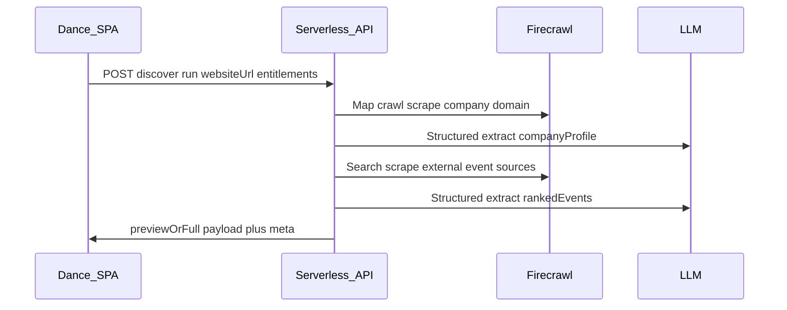

# Event Discovery (in-app, public preview, serverless API)

## Context

- Dance today is a **Vite + React SPA** with React Router ([`src/App.tsx`](/Users/scottymatthewman/Desktop/1-Projects/dance/src/App.tsx)), **no first-party backend**, and **no production auth/premium enforcement** (demo [`CURRENT_USER_ID`](/Users/scottymatthewman/Desktop/1-Projects/dance/src/state/store.ts)).
- Firecrawl and LLM keys **must not** ship to the browser; discovery logic runs **server-side**.

## Decision locked in

- **Backend shape:** **Serverless functions** (alongside static SPA hosting), holding secrets and enforcing entitlements at the **API boundary** (anonymous preview vs signed-in/premium).

## Product behavior (v1)

- **Route:** New in-app page e.g. `/discover` (still inside [`AppShell`](/Users/scottymatthewman/Desktop/1-Projects/dance/src/layouts/AppShell.tsx)) so visitors immediately see adjacent product surfaces (Home, Events, Settings) via sidebar—your “try feature → explore app → signup” loop stays natural.
- **Hero CTA:** “Try it with your company website” → URL submit → progressive loading UI.
- **Preview vs full:**
  - **Anonymous / free tier:** API returns **only the top 3 ranked events** (recommended default UX). Optionally include **`totalCandidates`** (e.g. “We ranked 10 matches”) **without** leaking rows 4–10 to the client (real gating is **omit data**, not blur-only).
  - **Premium / signed-in (stub → real later):** Full ranked list + exports if you add them.
  - **Filtering:** **Disabled** for preview tier (client UX + **server rejects** filter params without entitlement).
- **Signup path:** Inline CTAs after results (“Unlock full list”, “Save to workspace”) linking to **placeholder signup** until Clerk/Stripe/etc. lands.

**Note on “bottom 3 of 10”:** Technically possible but usually hurts comprehension; plan assumes **top 3 preview** unless you explicitly want the teaser pattern reversed.

## Architecture

### Serverless API responsibilities

- **Normalize URL** (https, redirect handling policy).
- **Ingest company site:** map/crawl/scrape within caps (max pages, depth, timeout).
- **Structured profile:** prompt + JSON schema (company fit rubric).
- **Event discovery:** web-wide discovery via Firecrawl capabilities you standardize on (search/extract/agent—pick one path for v1 to limit complexity).
- **Ranking:** deterministic sort keys where possible; LLM supplies scores + rationale fields constrained by schema.
- **Entitlements:**
  - Derive `tier` from **session/JWT** later; for now **`tier` stub** via header/cookie set only by trusted flows is OK short-term, but treat **anonymous IP rate limits** as mandatory.
  - **Strip gated fields server-side** for preview responses.

### Abuse / cost controls

- Per-IP + optional cookie-based quotas for anonymous runs.
- Hard budgets: max crawl pages, max tokens, max wall time; graceful degradation messages in UI.

## Frontend work (Dance SPA)

- Add route in [`src/App.tsx`](/Users/scottymatthewman/Desktop/1-Projects/dance/src/App.tsx): `/discover`.
- Add nav entry in [`src/components/dance/SidebarNav.tsx`](/Users/scottymatthewman/Desktop/1-Projects/dance/src/components/dance/SidebarNav.tsx).
- New page module e.g. [`src/pages/EventDiscoverPage.tsx`](/Users/scottymatthewman/Desktop/1-Projects/dance/src/pages/EventDiscoverPage.tsx):
  - URL input + validation
  - Stepper/progress (“Reading site”, “Finding events”, “Ranking”)
  - Results list UI matching Dance patterns (`transition-surface`, `pressable` per workspace motion rule)
  - Gated filter controls (disabled + tooltip/paywall modal)
  - CTA blocks pointing to core app areas (`/events`, planning surfaces as applicable)

### Client/server contract

- Add shared TypeScript types (and optionally Zod schemas) under e.g. [`src/types/eventDiscovery.ts`](/Users/scottymatthewman/Desktop/1-Projects/dance/src/types/eventDiscovery.ts); mirror or import from a small `shared/` folder if serverless code lives in-repo.

### Configuration

- **`VITE_DISCOVER_API_URL`** (or similar) for the SPA to call the deployed functions origin.
- Dev ergonomics: proxy in [`vite.config.ts`](/Users/scottymatthewman/Desktop/1-Projects/dance/vite.config.ts) to local serverless dev when supported by chosen provider.

## Serverless implementation notes (provider-agnostic)

Pick one hosting target for v1 (examples: **Vercel Functions**, **Netlify Functions**, **Cloudflare Workers**) and standardize:

- **One endpoint** `POST /discover` (name as needed) implementing the pipeline above.
- **`DISCOVERY_MOCK=1`** mode returning fixture JSON for cheap UI iteration.
- Structured logging with request IDs; avoid logging full page HTML.

## Later expansion (not required for first vertical slice)

- **Workspace-aware runs:** extend persisted workspace model in [`src/state/store.ts`](/Users/scottymatthewman/Desktop/1-Projects/dance/src/state/store.ts) with `companyWebsiteUrl` and default `/discover` prefill for signed-in users.
- **Real auth + billing:** replace stub tier with JWT/session claims; Stripe checkout or usage metering.

## Acceptance criteria (v1)

- Anonymous user can run discovery end-to-end from `/discover` and **always** receives **≤3** events from API.
- Filter requests are **blocked server-side** on anonymous tier.
- Premium/stub tier can retrieve full list (even if stubbed via dev flag initially—**must still be server-controlled**).
- No secrets in client bundle; CI/build fails if env leaks into Vite `import.meta.env` incorrectly.
