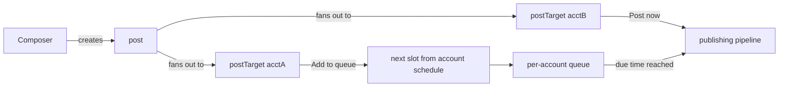

# Social Post Scheduler — Three-Phase Roadmap

Product: draft a post once, target any mix of connected X/LinkedIn accounts, then "Post now" or "Add to queue" (auto-schedules into each account's next available default slot). Each account owns its queue and schedule.

---

## Phase 1 — Product UI + data model (simulated accounts & publishing)

Everything runs in this Vite SPA against InstantDB. Accounts are "connected" via a dialog (no real OAuth); publishing is simulated. This is most of the product surface and is fully reusable in Phase 2.

### Setup

- InstantDB is currently in guest mode: create an Instant app, set `VITE_INSTANT_APP_ID` in `.env.local`, push schema/perms with `npx instant-cli push`.

### Data model — [src/instant.schema.ts](src/instant.schema.ts)

Replace the example `items` entity with:

- `socialAccounts` — `platform` ('x' | 'linkedin'), `handle`, `displayName`, `timezone`, `status` ('connected' | 'needs_reauth'), `scheduleSlots` (json array of `{ dayOfWeek, time }`), `createdAt`; linked to `$users` owner
- `posts` — `body`, `createdAt`, `updatedAt`; owner link; image attachments via Instant `$files`
- `postTargets` — links to one `post` + one `socialAccount`; `status` ('draft' | 'queued' | 'publishing' | 'published' | 'failed'), `scheduledAt`, `publishedAt`, `overrideBody` (per-platform caption), `resultUrl`, `error`

Mirror owner-scoped rules in [src/instant.perms.ts](src/instant.perms.ts) (same pattern as existing `items` rules).

### Features (following existing conventions: `features/<name>/<Name>Page.tsx`, mutations in `lib/instant/`)

- **Accounts page** (`features/accounts/`) — list accounts grouped by platform; "Connect account" dialog (platform + handle, simulated); per-account schedule editor (weekday/time slots, timezone); disconnect.
- **Composer** (`features/composer/`) — textarea with live per-platform character counters (280 X / 3,000 LinkedIn, X counts URLs as 23); multi-select account picker grouped by platform; per-platform caption override tabs (shared text is the default); image attach via `$files`; actions: **Post now** (simulated: marks targets published immediately) and **Add to queue**.
- **Queue page** (`features/queue/`) — per-account queue columns/list ordered by `scheduledAt`; reschedule, remove, and a dev-only "simulate publish" action; published/failed history section.
- **Scheduling logic** (`lib/scheduling.ts`) — pure function: given an account's slots + already-occupied `scheduledAt` times, return next available slot (timezone-aware via `date-fns`). Unit-testable, reused verbatim by the Phase 2 worker.
- **Platform rules** (`lib/platforms.ts`) — per-platform constants: char limits, image counts, label/icon. Single source of truth for composer validation.
- **Nav + routes** — add Composer, Queue, Accounts to [src/App.tsx](src/App.tsx) routes and `SidebarNav`, with flags in [src/config/features.ts](src/config/features.ts). Pages use `PageShell` / `PageHeader` and DESIGN.md surface/inset-edge conventions.

---

## Phase 2 — Backend service: real OAuth + publishing (plan to refine before starting)

A small separate deployable in `server/` (Hono on Node, deployed to Railway/Fly — or Cloudflare Workers + Cron). The SPA stays unchanged except the "Connect account" flow.

- **OAuth flows** — X (OAuth 2.0 PKCE, `tweet.write users.read offline.access`) and LinkedIn (`w_member_social` via self-serve "Share on LinkedIn" product). Server handles callback, stores encrypted tokens server-side (never in InstantDB client-readable entities), writes the `socialAccounts` row via Instant **admin SDK**.
- **Publishing worker** — cron every minute: query `postTargets` where `status = 'queued'` and `scheduledAt <= now`, set `publishing`, call platform API (X `POST /2/tweets`; LinkedIn Posts API with image register/upload), write back `published` + `resultUrl` or `failed` + `error`. Proactive token refresh for X; surface LinkedIn ~60-day token expiry as `needs_reauth`.
- **"Post now"** — switches from simulated to enqueue-with-`scheduledAt = now`.
- **Prereqs (do in parallel, approvals take days):** register X developer account + app; create LinkedIn developer app and request "Share on LinkedIn".
- Secrets: `INSTANT_ADMIN_TOKEN`, `X_CLIENT_ID/SECRET`, `LINKEDIN_CLIENT_ID/SECRET`, token-encryption key.

## Phase 3 — Polish & power features (plan to refine before starting)

- Failed-post retry with backoff + error UX; reconnect-account prompts.
- Calendar view of all scheduled posts; drag-to-reschedule; pause/shuffle queue.
- Per-target post previews (tweet card / LinkedIn card mockups) in the composer.
- X thread composing (chained tweets); video upload support.
- Queue health indicators (empty-queue warnings, slot utilization).

---

**Execution order:** Phase 1 now; revisit and detail Phase 2 once X/LinkedIn developer registrations are underway; Phase 3 after real publishing works end to end.